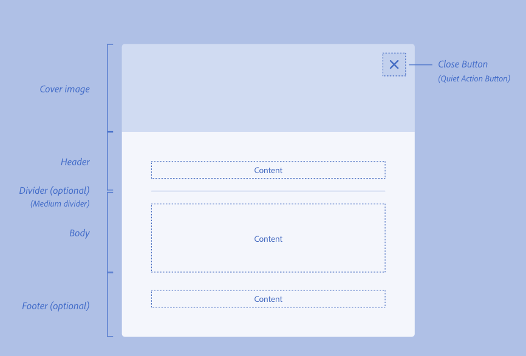

<!-- Copyright 2020 Adobe. All rights reserved.
This file is licensed to you under the Apache License, Version 2.0 (the "License");
you may not use this file except in compliance with the License. You may obtain a copy
of the License at http://www.apache.org/licenses/LICENSE-2.0
Unless required by applicable law or agreed to in writing, software distributed under
the License is distributed on an "AS IS" BASIS, WITHOUT WARRANTIES OR REPRESENTATIONS
OF ANY KIND, either express or implied. See the License for the specific language
governing permissions and limitations under the License. -->

import {Layout} from '@react-spectrum/docs';
export default Layout;

import docs from 'docs:@react-spectrum/dialog';
import {HeaderInfo, PropTable} from '@react-spectrum/docs';
import packageData from '../package.json';

```jsx import
import {ActionButton, Button, ButtonGroup} from '@react-spectrum/button';
import {Content, Footer, Header} from '@react-spectrum/view';
import {Checkbox} from '@react-spectrum/checkbox';
import {Dialog, DialogTrigger} from '@react-spectrum/dialog';
import {Divider} from '@react-spectrum/divider';
import {Form} from '@react-spectrum/form';
import {Heading, Text} from '@react-spectrum/typography';
import {Image} from '@react-spectrum/image';
import {TextField} from '@react-spectrum/textfield';
```

# Dialog

<p>{docs.exports.Dialog.description}</p>

<HeaderInfo
  packageData={packageData}
  componentNames={['Dialog']}
  sourceData={[
    {type: 'Spectrum', url: 'https://spectrum.adobe.com/page/dialog/'}
  ]} />

## Example

```tsx example
<DialogTrigger>
  <ActionButton>Trigger</ActionButton>
  {(close) => (
    <Dialog>
      <Header><Heading>The Heading</Heading></Header>
      <Divider />
      <Content>
        <Text>
          This is a dialog.
        </Text>
      </Content>
      <ButtonGroup>
        <Button variant="secondary" onPress={close}>Cancel</Button>
        <Button variant="cta" onPress={close}>Confirm</Button>
      </ButtonGroup>
    </Dialog>
  )}
</DialogTrigger>
```

## Content

A typical Dialog with a title, contents, and action buttons can be created like so:

```tsx example
<DialogTrigger>
  <ActionButton>Publish</ActionButton>
  {(close) => (
    <Dialog>
      <Header><Heading>Publish 3 pages</Heading></Header>
      <Divider />
      <Content>Confirm publish?</Content>
      <ButtonGroup>
        <Button variant="secondary" onPress={close}>Cancel</Button>
        <Button variant="cta" onPress={close} autoFocus>Confirm</Button>
      </ButtonGroup>
    </Dialog>
  )}
</DialogTrigger>
```

A dismissable Dialog forgoes a footer section and its associated action buttons in favor
of rendering a close button. If your Dialog is dismissable, make sure that you do not include a footer section or
a ButtonGroup. While the Dialog will hide any elements occupying the footer section, it will not remove them from the DOM, 
resulting in possible tab order issues.

```tsx example
<DialogTrigger isDismissable>
  <ActionButton>Status</ActionButton> 
  <Dialog>
    <Header><Heading>Status</Heading></Header>
    <Divider />
    <Content>Printer Status: Connected</Content>
  </Dialog>
</DialogTrigger>
```

It is important to note that the `Heading`, `Content`, and `Footer` content elements accept any renderable 
node, not just strings. This allows you to create Dialogs for more complex workflows, such as including a form
for the user to fill out or adding confirmation checkboxes.

```tsx example
<DialogTrigger>
  <ActionButton>Register</ActionButton> 
  {(close) => (
    <Dialog>
      <Header><Heading>Register for newsletter</Heading></Header>
      <Divider />
      <Content>
        <Form>
          <TextField label="First Name" placeholder="John" autoFocus />
          <TextField label="Last Name" placeholder="Smith" />
          <TextField label="Street Address" placeholder="123 Any Street" />
          <TextField label="City" placeholder="San Francisco" />
        </Form>
      </Content>
      <Footer>
        <Checkbox>
          I want to receive updates for exclusive offers in my area.
        </Checkbox>
      </Footer> 
      <ButtonGroup>
        <Button variant="secondary" onPress={close}>Cancel</Button>
        <Button variant="cta" onPress={close}>Register</Button>
      </ButtonGroup>
    </Dialog>
  )}
</DialogTrigger>
```

### Accessibility

The tab order within the Dialog follows the order of the children provided to the Dialog. 
This can be leveraged to create a logical flow separate from the reading order on the page.
You are also responsible for determining what component, if any, should be automatically 
focused on Dialog render. 

The example below sets initial focus to the Dialog's `Save` button and establishes 
the following tab order: `Save` button -> `Cancel` button -> `Textfield` -> `Checkbox`.

```tsx example
<DialogTrigger>
  <ActionButton>Set Profile</ActionButton>
  {(close) => (
    <Dialog>
      <Header><Heading>Profile</Heading></Header>
      <Divider />
      <ButtonGroup>
        <Button autoFocus variant="cta" onPress={close}>Save</Button>
        <Button variant="secondary" onPress={close}>Cancel</Button>
      </ButtonGroup>
      <Content>
        <Form>
          <TextField label="Name" />
          <Checkbox>Make private</Checkbox>
        </Form>
      </Content>    
    </Dialog>
  )}
</DialogTrigger>
```

### Advanced Usage

The grid layout of a Dialog is made up of the following elements and sections, mapped to the corresponding default slot names:

| Section/Element 	|     Slot      |
|-------------------|-------------- | 
| Container       	| container   	|
| Cover Image     	| hero        	|
| Header          	| header      	|
| Heading         	| heading     	|
| Type Icon       	| typeIcon    	|
| Divider         	| divider     	|
| Body            	| content     	|
| Footer          	| footer      	|
| Button Group      | buttonGroup   |
| Close Button    	| closeButton 	|


INSERT PICTURE HERE, MAYBE LINK TO SPECTRUM (Contributions is a corp site)

For an explanation of what slots are and how you can use them, see the [slots page](TODO LINK THIS PAGE).

Each of these sections can be populated by providing a content element paired with a corresponding `slot` prop
to the Dialog as children. Content elements like `Footer`, `Divider`, and `Header` map directly to their named `slot`,
but this can be overridden via the `slot` prop.

The example below illustrates how a Dialog with a hero image could be rendered via the `hero` slot:

```tsx example
<DialogTrigger>
  <ActionButton>Upload</ActionButton>
  {(close) => (
    <Dialog>
      <Image slot="hero" src="https://i.imgur.com/Z7AzH2c.png" objectFit="cover" />
      <Header><Heading>Upload file</Heading></Header>
      <Divider />
      <Content>Are you sure you want to upload this file?</Content>
      <ButtonGroup>
        <Button variant="secondary" onPress={close}>Cancel</Button>
        <Button variant="cta" onPress={close} autoFocus>Confirm</Button>
      </ButtonGroup>
    </Dialog>
  )}
</DialogTrigger>
```

## Labeling

### Accessibility

The title of a Dialog is typically provided via its header. By default, the Dialog sets its 
`aria-labelledby` to match the header id, but this can be overridden by providing a `aria-labelledby` prop
to the Dialog directly. If a visible label isn't specified, an `aria-label` must be provided instead.

```tsx example
<DialogTrigger>
  <ActionButton>See Terms and Conditions</ActionButton>
  {(close) => (
    <Dialog aria-labelledby="heading-id">
      <Text slot="header" id="heading-id">Terms and Conditions</Text> 
      <Divider />
      <Content>
        <React.Fragment>
          <Text>Lorem ipsum dolor sit amet, consectetur adipiscing elit, sed do eiusmod tempor incididunt ut labore et dolore magna aliqua. Mi proin sed libero enim. Mattis ullamcorper velit sed ullamcorper morbi tincidunt. Sed enim ut sem viverra aliquet eget sit amet tellus. Diam quis enim lobortis scelerisque fermentum dui faucibus in ornare. Diam quam nulla porttitor massa id. Eleifend mi in nulla posuere sollicitudin. Turpis nunc eget lorem dolor sed viverra ipsum nunc. Faucibus in ornare quam viverra. Risus commodo viverra maecenas accumsan lacus vel facilisis volutpat est. Nam libero justo laoreet sit amet cursus sit. Netus et malesuada fames ac. Dictum fusce ut placerat orci nulla pellentesque dignissim enim sit. Eros donec ac odio tempor orci. Ut etiam sit amet nisl purus in mollis nunc. Nisl rhoncus mattis rhoncus urna neque viverra. Convallis aenean et tortor at risus. Diam phasellus vestibulum lorem sed risus ultricies.</Text>
          <Text>Eleifend quam adipiscing vitae proin sagittis nisl. Diam donec adipiscing tristique risus. In fermentum posuere urna nec tincidunt praesent semper. Suspendisse in est ante in. Egestas diam in arcu cursus euismod quis viverra nibh cras. Aliquam sem fringilla ut morbi tincidunt augue interdum. Lacus sed turpis tincidunt id aliquet risus feugiat. Praesent semper feugiat nibh sed pulvinar proin. In massa tempor nec feugiat nisl pretium fusce id velit. Non nisi est sit amet facilisis. Mi in nulla posuere sollicitudin aliquam ultrices. Morbi leo urna molestie at elementum. Laoreet non curabitur gravida arcu ac tortor dignissim convallis. Risus quis varius quam quisque id. Platea dictumst quisque sagittis purus. Etiam non quam lacus suspendisse faucibus interdum posuere. Semper feugiat nibh sed pulvinar proin gravida hendrerit lectus.</Text>
          <Text>Risus ultricies tristique nulla aliquet enim tortor at. Ac placerat vestibulum lectus mauris. Sed viverra tellus in hac habitasse platea dictumst vestibulum rhoncus. Suspendisse ultrices gravida dictum fusce ut placerat orci nulla pellentesque. Sit amet nulla facilisi morbi tempus iaculis urna. Ut etiam sit amet nisl purus in. Risus at ultrices mi tempus imperdiet. Magna fermentum iaculis eu non diam phasellus. Orci sagittis eu volutpat odio. Volutpat blandit aliquam etiam erat velit scelerisque in dictum non. Amet nulla facilisi morbi tempus iaculis urna id. Iaculis eu non diam phasellus. Eu lobortis elementum nibh tellus molestie nunc. At tempor commodo ullamcorper a lacus vestibulum sed. Mi sit amet mauris commodo quis. Tellus elementum sagittis vitae et leo duis. Vel risus commodo viverra maecenas accumsan lacus.</Text>
          <Text>Ut porttitor leo a diam sollicitudin tempor id eu nisl. Tristique senectus et netus et malesuada fames ac turpis egestas. Tellus in hac habitasse platea dictumst vestibulum rhoncus est. Integer feugiat scelerisque varius morbi enim nunc faucibus a. Tempus quam pellentesque nec nam aliquam sem et. Quam viverra orci sagittis eu volutpat odio facilisis mauris. Nunc lobortis mattis aliquam faucibus purus in massa tempor. Tincidunt dui ut ornare lectus sit amet est. Magna fermentum iaculis eu non. Posuere sollicitudin aliquam ultrices sagittis orci a scelerisque. Vitae aliquet nec ullamcorper sit amet risus nullam eget felis. Vitae proin sagittis nisl rhoncus mattis rhoncus. Nunc vel risus commodo viverra maecenas. Diam in arcu cursus euismod. Dolor morbi non arcu risus quis varius quam. Amet nisl suscipit adipiscing bibendum. Nulla pellentesque dignissim enim sit amet venenatis. Nunc congue nisi vitae suscipit tellus mauris a diam maecenas. In hac habitasse platea dictumst vestibulum rhoncus est pellentesque elit</Text>
          <Text>Cras semper auctor neque vitae tempus quam pellentesque nec. Maecenas ultricies mi eget mauris pharetra et ultrices neque ornare. Vulputate enim nulla aliquet porttitor lacus luctus accumsan tortor posuere. Pellentesque habitant morbi tristique senectus et. Ipsum dolor sit amet consectetur adipiscing elit pellentesque. Sem et tortor consequat id porta nibh venenatis. Viverra nibh cras pulvinar mattis nunc sed blandit. Urna porttitor rhoncus dolor purus. Vivamus arcu felis bibendum ut. Cras sed felis eget velit aliquet. Sed tempus urna et pharetra pharetra. Viverra adipiscing at in tellus integer feugiat scelerisque varius morbi. Ac tortor vitae purus faucibus ornare suspendisse sed nisi lacus. Ultrices neque ornare aenean euismod elementum nisi quis eleifend quam. Vel turpis nunc eget lorem. Quisque egestas diam in arcu cursus euismod quis viverra. At tempor commodo ullamcorper a lacus vestibulum sed. Id aliquet lectus proin nibh nisl condimentum id venenatis. Quis viverra nibh cras pulvinar. Purus in mollis nunc sed.</Text>
        </React.Fragment>
      </Content>
      <ButtonGroup>
        <Button autoFocus variant="cta" onPress={close}>Acknowledge</Button>
      </ButtonGroup>
    </Dialog>
  )}
</DialogTrigger>
```

## Events

For Dialogs, user defined callbacks should be chained with the DialogTrigger's `close` function in the press/click handler
of the Dialog's action buttons. The following example alerts if the Dialog's save or cancel is clicked.

```tsx example
function Example() {
  let alertSave = (cb) => {
    cb();
    alert('Profile saved!');
  }

  let alertCancel = (cb) => {
    cb();
    alert('Profile not saved!');
  }

  return (
    <DialogTrigger>
      <ActionButton>Set Profile</ActionButton>
      {(close) => (
        <Dialog>
          <Header><Heading>Profile</Heading></Header>
          <Divider />
          <ButtonGroup>
            <Button autoFocus variant="cta" onPress={() => alertSave(close)}>Save</Button>
            <Button variant="secondary" onPress={() => alertCancel(close)}>Cancel</Button>
          </ButtonGroup>
          <Content>
            <Form>
              <TextField label="Name" />
              <Checkbox>Make private</Checkbox>
            </Form>
          </Content>    
        </Dialog>
      )}
    </DialogTrigger>
  );
}
```

Additionally, DialogTrigger accepts an `onOpenChange` prop which is triggered whenever the Dialog is opened or closed. 
For more information on the `onOpenChange` prop see [DialogTrigger page](TODO LINK HERE).

### Dismissable Dialogs

Dismissable Dialogs support a `onDismiss` prop which is triggered whenever the Dialog's close button is clicked.
Similar to non-dismissable dialogs, you must chain the DialogTrigger's `close` function with whatever callback you provide as
`onDismiss`.

```tsx example
function Example() {
  let alertDismiss = (cb) => {
    cb();
    alert('Dialog dismissed.');
  }

  return (
    <DialogTrigger isDismissable>
      <ActionButton>Info</ActionButton>
      {(close) => (
        <Dialog onDismiss={() => alertDismiss(close)}>
          <Header><Heading>Version Info</Heading></Header>
          <Divider />
          <Content>
            <Text>
              Version 1.0.0, Copyright 2020
            </Text>
          </Content>    
        </Dialog>
      )}
    </DialogTrigger>
  );
}
```

Note that `onDismiss` is optional. If you don't need to add a `onDismiss` handler to your dismissable Dialog, you may omit
the wrapping `close` function surround the Dialog.

## Props

<PropTable component={docs.exports.Dialog} links={docs.links} />

## Visual Options

### Size

Only `modal` type Dialogs support a user defined size prop. Note that the `fullscreen` and `fullscreenTakeover` sizes 
require the [DialogTrigger `type`](TODO LINK) prop to be set as `fullscreen` and `fullscreenTakeover` respectively for container sizing
considerations.

```tsx example
<DialogTrigger>
  <ActionButton>Set Profile</ActionButton>
  {(close) => (
    <Dialog size="S">
      <Header><Heading>Profile</Heading></Header>
      <Divider />
      <ButtonGroup>
        <Button autoFocus variant="cta" onPress={close}>Save</Button>
        <Button variant="secondary" onPress={close}>Cancel</Button>
      </ButtonGroup>
      <Content>
        <Form>
          <TextField label="Name" />
          <Checkbox>Make private</Checkbox>
        </Form>
      </Content>    
    </Dialog>
  )}
</DialogTrigger>

<DialogTrigger>
  <ActionButton>Set Profile</ActionButton>
  {(close) => (
    <Dialog size="M">
      <Header><Heading>Profile</Heading></Header>
      <Divider />
      <ButtonGroup>
        <Button autoFocus variant="cta" onPress={close}>Save</Button>
        <Button variant="secondary" onPress={close}>Cancel</Button>
      </ButtonGroup>
      <Content>
        <Form>
          <TextField label="Name" />
          <Checkbox>Make private</Checkbox>
        </Form>
      </Content>    
    </Dialog>
  )}
</DialogTrigger>

<DialogTrigger>
  <ActionButton>Set Profile</ActionButton>
  {(close) => (
    <Dialog size="L">
      <Header><Heading>Profile</Heading></Header>
      <Divider />
      <ButtonGroup>
        <Button autoFocus variant="cta" onPress={close}>Save</Button>
        <Button variant="secondary" onPress={close}>Cancel</Button>
      </ButtonGroup>
      <Content>
        <Form>
          <TextField label="Name" />
          <Checkbox>Make private</Checkbox>
        </Form>
      </Content>    
    </Dialog>
  )}
</DialogTrigger>
```
