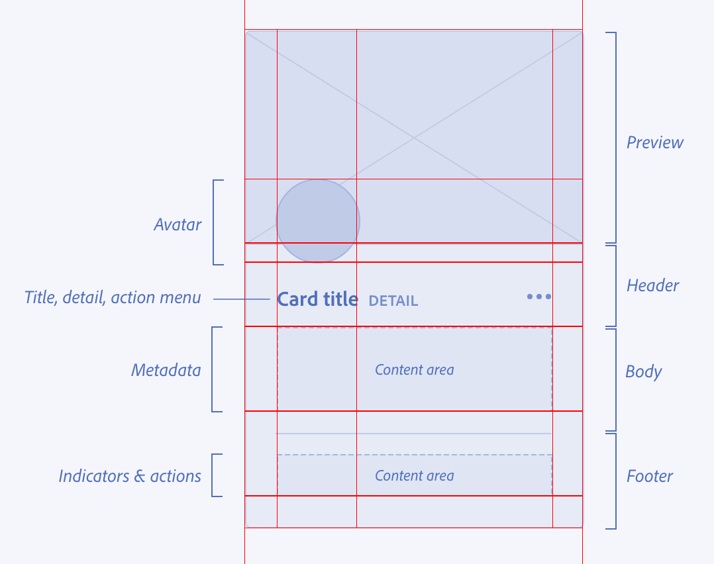

<!-- Copyright 2020 Adobe. All rights reserved.
This file is licensed to you under the Apache License, Version 2.0 (the "License");
you may not use this file except in compliance with the License. You may obtain a copy
of the License at http://www.apache.org/licenses/LICENSE-2.0
Unless required by applicable law or agreed to in writing, software distributed under
the License is distributed on an "AS IS" BASIS, WITHOUT WARRANTIES OR REPRESENTATIONS
OF ANY KIND, either express or implied. See the License for the specific language
governing permissions and limitations under the License. -->

- Start Date: 2019-10-31
- RFC PR: (leave this empty, to be filled in later)
- Authors: Rob Snow

# React Spectrum v3 Slots Architecture (NAME TBD)

## Summary

Sometimes we need to make a container component that can have multiple complex layouts to solve a variety of use cases.
By default we want it to be easy to do the “right thing”.
Children to a component should be laid out in the right places regardless of the components used or what order they appear in the DOMs.

For instance:
```jsx
<Card>
  <Image />
  <Avatar />
</Card>
```
should produce the same design as
```jsx
<Card>
  <Avatar />
  <Image />
</Card>
```

## Motivation

We want to separate design from implementation. It's been historically hard to solve the problem of where to place child components.
Some approaches that have been tried.

   - components expect children in a specific structure and order
        - hard to document, difficult for people to remember, can’t evolve with design easily
   - components expect a specific set of children and some method to identify them
        - in React it’s hard to identify children, sometimes there can be HoC’s in-between the container and any given child
   - components expose props for different slots where they will render, they are limited to no children (Web components)
        - isn’t all that flexible for overriding, requires us to update when design updates
   - helper layout components are used (Box - Chakra, Adobe Flex)
        - dom structure is locked in, so if there’s a different layout for smaller screens, then a new dom structure is needed

## Design Example

We would like to have our designs not be dependent on the underlaying dom structure.
This should make it easier to swap out designs (responsive) or update the design.

We'd like for design to give us a wireframe that has named regions and a clear underlying grid where elements should be placed.
Potentially something like this.


## CSS Example

To accomplish this we can leverage CSS Grid.
Children of a grid can specify the areas in the grid that they take up.

For the CSS, we might get something like this.
```css
.spectrum-Card {
  border: 1px solid lightgrey;
  border-radius: 4px;
  background: white;
}

/* example grid css https://css-tricks.com/snippets/css/complete-guide-grid/ */
.container {
  display: grid;
  grid-template-columns: 14px auto 1fr 1fr 14px;
  grid-template-rows: auto 32px 16px minmax(30px, auto) auto auto 10px;
  grid-template-areas:
    "preview preview    preview  preview   preview"
    ".       avatar     .        .         ."
    ".       avatar     .        .         ."
    ".       title      title    title     ."
    ".       body       body     body      ."
    ".       divider    divider  divider   ."
    ".       footer     footer   footer    ."
    ".       .          .        .         .";
}

.preview {
  grid-area: preview-start / preview-start / span 2 /preview-end;
  height: 200px; /* build into grid template? minmax? */
}

.avatar {
  grid-area: avatar;
  z-index: 1;
  height: 48px; /* this would ideally be off in avatar land */
  width: 48px;
}

.title {
  grid-area: title;
}

.body {
  grid-area: body;
}

.divider {
  grid-area: divider;
}

.footer {
  grid-area: footer; /* this might be an issue because footer is a reserved word */
}
```

## React Example

We would introduce a new component, 'Grid' (tbd name), that would accept a CSS Module for its `slots` prop.
This module would be expected to provide a mapping of Grid CSS Area to classname that has `grid-area: area-name`.

```jsx
export const Card = (props) => {
  let defaults = {slots: {
      container: classNames(styles, 'container'),
      preview: classNames(styles, 'preview'),
      avatar: classNames(styles, 'avatar'),
      title: classNames(styles, 'title'),
      footer: classNames(styles, 'footer'),
      divider: classNames(styles, 'divider')
    }};
  let {slots} = {...defaults, ...props};

  return (
    <div className={classNames(styles, 'spectrum-Card')}>
      <Grid slots={slots}>
        <Image slot="preview" />
        <Avatar slot="avatar" />
        <Flex slot="title">
          <Title>Title</Title>
          <Button>More</Button>
        </Flex>
        <Description slot="description">Description</Description>
        <Footer slot="footer">Final remarks</Footer>
      </Grid>
    </div>
  );
};
```

Or to make a more general container.
```jsx
export const Card = (props) => {
  let defaults = {slots: {
      container: classNames(styles, 'container'),
      preview: classNames(styles, 'preview'),
      avatar: classNames(styles, 'avatar'),
      title: classNames(styles, 'title'),
      footer: classNames(styles, 'footer'),
      divider: classNames(styles, 'divider')
    }};
  let {slots} = {...defaults, ...props};

  return (
    <div className={classNames(styles, 'spectrum-Card')}>
      <Grid slots={slots}>
        {props.children}
      </Grid>
    </div>
  );
};
```

## End user example

An end user could just use our Cards, but they may also want to specify their own grid.
Components that implement grid layouts should expose their slots to override the grid.

I've included a special Slot component, but it's not strictly necessary depending on the implementation. What is necessary is that all slots are direct descendants in the DOM of the container displaying grid.
Items that aren't children of the grid do not participate in grid layout. [MDN](https://developer.mozilla.org/en-US/docs/Web/CSS/CSS_Grid_Layout/Basic_Concepts_of_Grid_Layout#Nesting_grids)

```jsx
import styles from './CustomCardStyles.css';

<Card slots={styles}>
  <Image slot="preview" />
  <Avatar slot="avatar" />
  <Flex slot="title">
    <Title>Title</Title>
    <Button>More</Button>
  </Flex>
  <Description slot="description">Description</Description>
  <Footer slot="footer">Final remarks</Footer>
</Card>
```


## Decoupled from design

These next examples show how easily we can achieve vastly different layouts without changing anything in React Spectrum or in products.
Only the things that need changing have been included.

It's all CSS.

Both of these examples use the same JSX from the [previous example](#end-user-example)

#### Horizontal layout
Design


Spectrum CSS

```css
.container {
  display: grid;
  grid-template-columns: auto 5px 200px;
  grid-template-rows: auto 1fr;
  grid-template-areas:
    "preview . title"
    "preview . body";
}

.preview {
  grid-area: preview;
}

.title {
  grid-area: title;
  margin: 5px 5px 5px 0; /* ideally off in heading land */
}

.body {
  grid-area: body;
}

/* these have no place in the grid, hide them :) */
.avatar, .divider, .footer {
  display: none;
}
```


#### Custom layout
Design


Custom CSS
```css
.container {
  display: grid;
  grid-template-columns: 14px auto 1fr 1fr 14px;
  grid-template-rows: 5px auto auto auto auto 5px;
  grid-template-areas:
    ".       .          .        .         ."
    ".       avatar     title    title     ."
    ".       body       body     body      ."
    "preview preview    preview  preview   preview"
    ".       footer     footer   footer    ."
    ".       .          .        .         .";
}


.avatar {
  grid-area: avatar;
  align-self: center;
  height: 48px;
  width: 48px;
}

.title {
  grid-area: title;
  align-self: center;
}

.body {
  grid-area: body;
}

.preview {
  grid-area: preview;
  height: 200px;
}

.footer {
  grid-area: footer;
}
```

## What components need to implement Slot

We have a couple options here:
 - All of our Components could implement this
 - We could build a <Box> like component that takes a `renderAs` prop and the name of the dom element it needs to render, this `Box` component would replace the top level node of every Component we create. All components would still need to accept a 'slot' prop and pass it through to <Box>.
 
## What new components are needed
 - Grid (name?)
 - Flex (maybe in a different PR?)
 - Box?
 
## What components should support the slot prop?
 - every component
 - semantic elements should have a default slot name

## What will this take

 - Buy in from Spectrum CSS
 - Buy in from Design
 - New CSS
